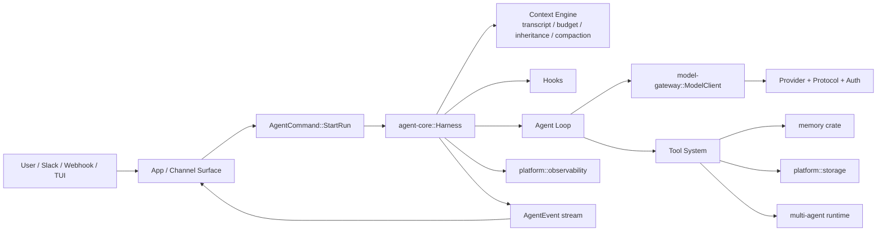

# Hebbian 架构文档

## 设计前言：这个项目为什么要这样做

这部分不是抽象架构原则，而是项目一开始就应该被保留下来的设计动机。

### 我对这个项目的核心判断

- 我现在想借鉴 `claude-code-haha`，但不是照搬它的实现细节。
- 我真正想借鉴的是它背后的 **harness engineering** 思路。
- 现在 App 里可以只有一个 agent 页面入口，但这个页面只是入口，不应该成为 agent 本体。
- 以后这个项目不应该只停留在桌面窗口，还要能自然长出：
  - TUI
  - server
  - ACP
  - 以及更多外部 channel 接入
- 所以前期架构必须既**足够简单**，又**天然可扩展**。

### 这里说的“简单”是什么意思

这里的简单，不是功能简单，也不是能力弱，而是：

- 不要过度设计
- 不要过度抽象
- 不要一开始就做插件系统、复杂 DAG、agent team、scheduler、memory graph
- 不要把 UI、运行时、模型访问、工具、权限、状态都混在一起
- 先把真正长期稳定的边界切清楚

也就是说，这个项目追求的是：

> **简单的结构，清楚的边界，稳定的协议，后续可扩展的核心。**

### 这个项目最重要的产品判断

> **Agent = Model + Harness**

模型不是产品，真正可扩展、可复用、可持续演化的是外层那一层 harness：

- 上下文管理
- 工具系统
- 权限控制
- 状态机
- 事件流
- 验证
- 恢复
- 记忆
- 运行时边界

也就是说：

- UI surface 只是入口
- Agent harness 才是产品核心
- Runtime / Model adapters 负责连接 Claude / Codex / Gemini / 未来更多 provider

### 这个项目一开始就应该坚持的方向

当前只保留一个 agent 页面入口，是为了先把核心跑通；
但从架构上，这个入口绝不能和 agent 本体绑死。

正确方向应该是：

- **一个稳定的 Agent Core / Harness**
- **一个统一的 Model Gateway**
- **多个可替换的 Surface**
- **多个可扩展的 Channel**

这样以后接：
- Desktop
- TUI
- Server
- Slack / Webhook / Cron
- ACP / workflow

都不是重写 agent，而只是给同一个核心增加新的入口和适配层。

### 这一份架构文档要解决的问题

所以本文档不是在描述“当前 Tauri 工程怎么分目录”，而是在回答下面几个更本质的问题：

1. 哪一层才是产品核心？
2. 哪一层只是入口壳？
3. provider / oauth / protocol 应该归在哪？
4. subagent / multi-agent 将来怎么自然长出来？
5. context / memory / hooks / observability 应该挂在哪一层？
6. 将来扩展到 TUI / server / ACP / openclaw 风格 channel 时，哪些部分应该完全不用重写？

如果后面的任何设计违背了这段前言，就说明架构开始偏了。

> 本文档描述 Hebbian 的目标架构。核心原则：**Agent 核心能力是产品本体；桌面窗口、TUI、Server、Slack/Webhook 都只是外层入口或通道**。

---

## 0. 先明确边界

你提的修正是对的，之前那版里 `src-tauri/` 过于像“后端实现细节”，但从产品视角看，真正应该站在中心的是：

1. **Agent Core**：输入编排、agent loop、tool system、上下文管理、权限、记忆、压缩、可观测性
2. **Model Gateway**：统一的模型请求抽象；provider / protocol / auth 都是它下面的适配细节
3. **Apps / Surfaces**：桌面窗口、TUI、Server API，这些都是入口壳层
4. **Channels**：Slack / Webhook / Cron / Email 等外部事件来源

也就是说：
- `desktop app` 不是产品核心，只是一个 surface
- `Tauri` 不是架构中心，只是当前桌面端宿主
- `provider` 和 `oauth` 不属于 agent harness 本身，它们属于 **Model Gateway**
- `subagent` 也不该只是一个“工具技巧”，而应该是 Core 协议支持的一种运行模式

所以新的组织方式应该是：

- **最内层：Agent Runtime / Harness Core**
- **中间层：Model Gateway / Memory / Storage / Observability**
- **外层：Apps 与 Channels**

---

## 1. 从微观到宏观的包裹图

你说得对，上一版更像“分层模块图”，不是严格意义上的“由小到大包起来”。

这里改成两张图：

1. **包裹图**：表达“谁被谁包住，谁是内核，谁是外壳”
2. **连线图**：表达“运行时数据和控制流怎么走”

### 1.1 包裹图：从最内核到最外层

下面这张图不要按“左右并列”去读，而要按“中心 → 外围”去读。

```text
┌──────────────────────────────────────────────────────────────────────────────┐
│ Hebbian                                                                    │
│                                                                              │
│  ┌────────────────────────────────────────────────────────────────────────┐  │
│  │ Apps / Surfaces + External Channels                                   │  │
│  │                                                                        │  │
│  │  入口 / 表现层                                                          │  │
│  │  - Desktop App (React UI + Tauri Shell)                               │  │
│  │  - TUI App                                                             │  │
│  │  - Server App (HTTP / WS / SSE)                                        │  │
│  │  - Slack / Webhook / Cron / Email / CLI Trigger                        │  │
│  │                                                                        │  │
│  │   它们不实现 agent 本体，只负责：                                      │  │
│  │   输入接入 / 命令转发 / 事件渲染 / 外部回写                              │  │
│  │                                                                        │  │
│  │   ┌────────────────────────────────────────────────────────────────┐   │  │
│  │   │ Platform Services                                              │   │  │
│  │   │                                                                │   │  │
│  │   │  横切支撑层                                                     │   │  │
│  │   │  - Storage         transcript / event log / blob / snapshot    │   │  │
│  │   │  - Memory          user / project / feedback / reference       │   │  │
│  │   │  - Observability   logs / metrics / traces / replay            │   │  │
│  │   │  - Config/Policy   agent defs / hooks / permissions            │   │  │
│  │   │                                                                │   │  │
│  │   │   ┌────────────────────────────────────────────────────────┐   │   │  │
│  │   │   │ Model Gateway                                          │   │   │  │
│  │   │   │                                                        │   │   │  │
│  │   │   │  统一模型访问层                                         │   │   │  │
│  │   │   │  - ModelClient trait                                   │   │   │  │
│  │   │   │  - Provider registry                                   │   │   │  │
│  │   │   │  - Protocol adapters                                   │   │   │  │
│  │   │   │  - Auth / Credentials                                  │   │   │  │
│  │   │   │                                                        │   │   │  │
│  │   │   │   ┌────────────────────────────────────────────────┐   │   │   │  │
│  │   │   │   │ Agent Core / Harness                          │   │   │   │  │
│  │   │   │   │                                                │   │   │   │  │
│  │   │   │   │  最内核 / 产品本体                             │   │   │   │  │
│  │   │   │   │  - AgentCommand / AgentEvent                  │   │   │   │  │
│  │   │   │   │  - Harness / Run lifecycle                    │   │   │   │  │
│  │   │   │   │  - Agent loop                                 │   │   │   │  │
│  │   │   │   │  - Tool system + permission gate              │   │   │   │  │
│  │   │   │   │  - Context engine + compaction                │   │   │   │  │
│  │   │   │   │  - Multi-agent runtime                        │   │   │   │  │
│  │   │   │   │  - Hooks                                      │   │   │   │  │
│  │   │   │   │                                                │   │   │   │  │
│  │   │   │   └────────────────────────────────────────────────┘   │   │   │  │
│  │   │   │                                                        │   │   │  │
│  │   │   └────────────────────────────────────────────────────────┘   │   │  │
│  │   │                                                                │   │  │
│  │   └────────────────────────────────────────────────────────────────┘   │  │
│  │                                                                        │  │
│  └────────────────────────────────────────────────────────────────────────┘  │
│                                                                              │
└──────────────────────────────────────────────────────────────────────────────┘
```

### 1.2 这张包裹图的正确读法

#### 最里面：`Agent Core / Harness`
这是**最微观、最稳定、最应该长期守住边界**的一层。

它解决的不是“Claude 怎么调用”，而是：
- run 如何创建和结束
- loop 如何推进
- tool 如何执行
- permission 如何拦截
- context 如何继承和压缩
- 多 agent 如何组织
- event 如何广播

也就是说，**真正的产品本体在这里**。

#### 往外一层：`Model Gateway`
它是 Core 调模型时经过的统一网关。

这一层负责：
- 统一 `ModelRequest -> ModelChunk`
- 收敛 provider 差异
- 收敛 protocol 差异
- 收敛 auth / oauth / credentials 差异

所以：
- `providers`
- `oauth`
- `device flow`
- `api key`
- `session import`

都应该在这一层，不应该散在 agent core 外面到处都是。

#### 再往外：`Platform Services`
这是所有核心能力依赖的横切支撑：
- storage
- memory
- observability
- config / policy

它们很重要，但它们不是“agent loop 本身”，所以应该包在 core 外围，作为支撑层。

#### 最外层：`Apps / Surfaces + External Channels`
这是最宏观、最容易变化的一层。

它包含：
- desktop
- tui
- server
- slack/webhook/cron/email

这些都是入口或表现形式，**不应该反过来塑造内核结构**。

---

## 2. 运行时连线图：这些层之间怎么连

上面那张图回答“谁包着谁”；下面这张图回答“运行时怎么流动”。

```text
[User / Slack / Webhook / Cron / TUI]
                │
                ▼
      [App Surface / Channel Adapter]
                │
                │ 1. 转成 AgentCommand
                ▼
          [Agent Core / Harness]
                │
      ┌─────────┼───────────────────────────────────────────────┐
      │         │                                               │
      │         │ 2. 读/写 transcript、budget、summary         │
      │         ▼                                               │
      │   [Context Engine]                                      │
      │                                                         │
      │ 3. before/after hook                                    │
      ▼                                                         │
    [Hooks]                                                     │
      │                                                         │
      │ 4. 需要模型输出                                         │
      ▼                                                         │
       [Agent Loop] ───────────────► [Model Gateway] ─────────► [Provider/Auth/Protocol]
      │                                                         │
      │ 5. 需要工具调用                                         │
      ▼                                                         │
 [Tool System + Permission Gate]                                │
      │                                                         │
      ├──────────────► [Memory]                                 │
      ├──────────────► [Storage / Blob / EventLog]              │
      ├──────────────► [Multi-Agent Runtime] ───────► [Child Agent Core Run]
      │                                                         │
      └──────────────► [Observability]
                │
                │ 6. 发出 AgentEvent 流
                ▼
      [App Surface / Channel Adapter]
                │
                ▼
   [UI 渲染 / Slack 回复 / Webhook 响应 / TUI 输出]
```

### 2.1 这张连线图要表达的重点

#### 入口永远先变成 `AgentCommand`
不管是：
- 用户在桌面输入
- TUI 输入
- Slack mention
- Webhook POST

都先变成统一命令，再进 `Agent Core`。

#### Core 是唯一编排中心
- 不是 UI 在编排
- 不是 provider 在编排
- 不是 Slack channel 在编排

所有流程都由 Harness 驱动。

#### 模型访问必须经过 `Model Gateway`
Core 不直接知道 Claude 的 OAuth 细节，也不直接拼 Gemini 的 HTTP payload。

#### 工具、记忆、存储、多 agent 都围绕 Core 转
这些能力都应该被 Core 调度，而不是各自偷偷运行。

#### 输出永远回到 `AgentEvent`
无论最终展示在：
- Desktop UI
- TUI
- Slack
- Webhook response

本质上都应该消费同一条事件流。

---

## 3. 为什么这次不是“平铺图”了

这次你可以把它理解成两个正交视角：

### 视角 A：包裹关系
回答：
- 哪层是内核
- 哪层是支撑
- 哪层是入口
- 谁应该稳定，谁应该频繁变化

### 视角 B：运行连线
回答：
- 输入从哪进
- Core 怎么调模型
- Core 怎么调工具
- 子 agent 怎么接上来
- 事件怎么回到外层

这两个视角合起来，才是你要的：
**既有从微观到宏观的一层层包裹，也有块与块之间的实际连接。**

---

## 4. 正确的目录中心应该是什么
你的判断是对的：不应该让 `src-tauri/` 成为视觉中心。建议把仓库结构调整成“核心在中间，App 只是一个子目录”。

## 3. 推荐目录结构（按产品边界组织）

```text
Hebbian/
├── apps/                                      # 各种入口 / 壳层
│   ├── desktop/                               # 桌面版（当前 Tauri + React）
│   │   ├── ui/                                # React 页面、组件、样式
│   │   ├── bridge/                            # Tauri IPC / window event bridge
│   │   └── shell/                             # Tauri app 启动、菜单、窗口管理
│   │
│   ├── tui/                                   # 未来终端版
│   │   ├── app/
│   │   ├── renderer/
│   │   └── input/
│   │
│   └── server/                                # 未来服务端入口
│       ├── http/
│       ├── ws/
│       ├── sse/
│       └── auth/
│
├── crates/
│   ├── agent-core/                            # ★ 产品核心：Agent Harness
│   │   ├── src/
│   │   │   ├── lib.rs
│   │   │   ├── types.rs                       # AgentCommand / AgentEvent / IDs
│   │   │   ├── harness.rs                     # run 生命周期 / event bus / registry
│   │   │   ├── loop.rs                        # 通用 agent loop
│   │   │   ├── definition.rs                  # AgentDefinition / role / policy
│   │   │   ├── session.rs                     # transcript / replay / snapshot
│   │   │   ├── context/
│   │   │   │   ├── mod.rs
│   │   │   │   ├── transcript.rs
│   │   │   │   ├── compaction.rs             # 压缩策略
│   │   │   │   ├── budget.rs                 # token budget
│   │   │   │   └── inheritance.rs            # ContextPolicy
│   │   │   ├── tools/
│   │   │   │   ├── mod.rs
│   │   │   │   ├── registry.rs
│   │   │   │   ├── executor.rs
│   │   │   │   ├── permissions.rs
│   │   │   │   ├── spawn_agent.rs
│   │   │   │   ├── spawn_parallel.rs
│   │   │   │   └── resource_tools.rs
│   │   │   ├── multi_agent/
│   │   │   │   ├── mod.rs
│   │   │   │   ├── tree.rs                   # parent/child run graph
│   │   │   │   ├── scheduler.rs              # fan-out / wait / aggregate
│   │   │   │   └── resources.rs              # blackboard / shared resource
│   │   │   ├── hooks/
│   │   │   │   ├── mod.rs
│   │   │   │   ├── manager.rs
│   │   │   │   ├── types.rs
│   │   │   │   └── external.rs
│   │   │   └── runtime/
│   │   │       ├── mod.rs
│   │   │       ├── cancel.rs
│   │   │       └── clock.rs
│   │
│   ├── model-gateway/                         # ★ 统一模型层
│   │   ├── src/
│   │   │   ├── lib.rs
│   │   │   ├── types.rs                       # ModelRequest / ModelChunk / Usage
│   │   │   ├── client.rs                      # ModelClient trait
│   │   │   ├── registry.rs                    # provider registry
│   │   │   ├── routing.rs                     # model/provider 选择
│   │   │   ├── protocols/
│   │   │   │   ├── mod.rs
│   │   │   │   ├── claude.rs
│   │   │   │   ├── openai.rs
│   │   │   │   ├── gemini.rs
│   │   │   │   └── codex.rs
│   │   │   ├── providers/
│   │   │   │   ├── mod.rs
│   │   │   │   ├── claude.rs
│   │   │   │   ├── codex.rs
│   │   │   │   ├── gemini.rs
│   │   │   │   ├── openai.rs
│   │   │   │   └── mock.rs
│   │   │   ├── auth/
│   │   │   │   ├── mod.rs
│   │   │   │   ├── api_key.rs
│   │   │   │   ├── oauth/
│   │   │   │   │   ├── mod.rs
│   │   │   │   │   ├── claude.rs
│   │   │   │   │   ├── codex.rs
│   │   │   │   │   └── gemini.rs
│   │   │   │   └── credential_store.rs
│   │   │   └── discovery/
│   │   │       ├── mod.rs
│   │   │       └── models.rs
│   │
│   ├── memory/                                # ★ 可扩展记忆系统
│   │   ├── src/
│   │   │   ├── lib.rs
│   │   │   ├── types.rs
│   │   │   ├── store.rs                       # MemoryStore trait
│   │   │   ├── fs.rs
│   │   │   ├── sqlite.rs
│   │   │   ├── vector.rs
│   │   │   ├── retrieval.rs
│   │   │   └── formatting.rs
│   │
│   ├── platform/                              # ★ 通用基础设施
│   │   ├── src/
│   │   │   ├── lib.rs
│   │   │   ├── storage/
│   │   │   │   ├── mod.rs
│   │   │   │   ├── json.rs
│   │   │   │   ├── atomic.rs
│   │   │   │   ├── blobs.rs
│   │   │   │   └── events.rs
│   │   │   ├── observability/
│   │   │   │   ├── mod.rs
│   │   │   │   ├── logs.rs
│   │   │   │   ├── metrics.rs
│   │   │   │   ├── traces.rs
│   │   │   │   └── pricing.rs
│   │   │   └── config/
│   │   │       ├── mod.rs
│   │   │       ├── agent_defs.rs
│   │   │       ├── permissions.rs
│   │   │       └── hooks.rs
│   │
│   └── channels/                              # ★ 外部通道适配层
│       ├── src/
│       │   ├── lib.rs
│       │   ├── types.rs
│       │   ├── inbound.rs                     # InboundChannel trait
│       │   ├── outbound.rs                    # OutboundRenderer trait
│       │   ├── slack.rs
│       │   ├── webhook.rs
│       │   ├── cron.rs
│       │   ├── email.rs
│       │   └── cli.rs
│
├── configs/                                   # 配置与内置 agent 角色定义
│   ├── agents/
│   │   ├── orchestrator.yaml
│   │   ├── researcher.yaml
│   │   ├── coder.yaml
│   │   ├── reviewer.yaml
│   │   └── support.yaml
│   └── hooks/
│
└── docs/
    └── ARCHITECTURE.md
```

---

## 4. 每一层到底负责什么

## 4.1 `agent-core`：唯一的产品核心

`agent-core` 只解决“一个 agent 如何可靠地运行”。它不关心：
- 是桌面触发还是 Slack 触发
- 下面用 Claude 还是 Gemini
- 凭据来自 API key 还是 OAuth

它只关心这些事情：

### 输入到输出的完整链路
1. 接受一个 `StartRun` 命令
2. 创建 run 状态
3. 根据上下文策略组装上下文
4. 触发 hooks
5. 调用 `ModelClient`
6. 解析模型输出
7. 如有 tool call，则权限检查并执行工具
8. 工具结果回灌 transcript
9. 必要时做上下文压缩
10. 持续发出 `AgentEvent`
11. 最终结束、失败或取消

### 它应该拥有的子系统
- 协议：`AgentCommand / AgentEvent`
- Harness：生命周期、event bus、replay
- Agent loop
- Tool system
- 权限系统
- 上下文系统
- 多 agent runtime
- Hooks
- Run graph / child run tree

### 它不应该直接拥有的东西
- OAuth 细节
- 各 provider 的 HTTP 请求格式
- 窗口管理
- Tauri IPC 细节
- Slack API SDK

这些都应该在 Core 外层。

---

## 4.2 `model-gateway`：统一模型访问层

这个目录就是你说的：**providers + oauth 都应该收敛到一个统一目录里**。

它的职责不是“做 agent”，而是：

> 给上层提供一个统一的“我想向模型发请求”的接口，不管底下是 Claude / Codex / Gemini / OpenAI，也不管是 API key / OAuth / Device Flow。

### 统一抽象

```rust
#[async_trait]
pub trait ModelClient: Send + Sync {
    fn id(&self) -> &str;

    async fn stream(
        &self,
        req: ModelRequest,
        cancel: CancellationToken,
    ) -> Result<BoxStream<'static, ModelChunk>, ModelError>;
}
```

### `model-gateway` 内部分三层

#### A. `types / client / routing`
给 `agent-core` 一个稳定的 provider-neutral 接口。

#### B. `providers / protocols`
- `providers/`：按供应商组织具体实现
- `protocols/`：把统一请求/响应映射到 provider-specific payload

这个拆法的意义是：
- 有的 provider 可能协议相似但认证不同
- 有的 provider 认证相似但流式事件协议不同
- 可以把“请求怎么发”和“这个供应商怎么配置”分开

#### C. `auth`
- API key
- OAuth
- Device flow
- 凭据导入
- keychain / 文件 / 环境变量

这些都应该是 **模型访问层的能力**，不是 agent core 的能力。

---

## 4.3 `memory`：独立可替换的记忆系统

记忆系统不应埋在 `agent-core` 里写死。

正确关系是：
- `agent-core` 只知道“我可以 query memory / write memory”
- 具体是 Markdown、SQLite、向量库，交给 `memory` crate

这样好处是：
- 以后可替换后端
- 以后可支持 project / global / agent scoped memory
- 以后可接远端 knowledge base
- 不会把 harness 变成一坨大杂烩

---

## 4.4 `platform`：基础设施，不是业务核心

这里放四类横切能力：

### storage
- transcript 持久化
- event log
- blob store
- snapshot

### observability
- logs
- metrics
- traces
- 成本统计

### config
- agent 定义
- permission policy
- hooks policy

这些很重要，但它们是平台支撑层，不是 agent loop 本身。

---

## 4.5 `channels`：外部世界接入层

这是未来 openclaw 风格最需要的一层。

它负责：
- Slack 消息进来后怎么转成 `StartRun`
- Webhook 请求怎么映射到 agent
- Cron 触发如何启动后台 run
- Run 中的 event 如何渲染回 Slack / webhook response / email reply

所以 `channels` 既不属于 app，也不属于 model。它是一层独立的 **外部通道适配器**。

---

## 5. 输入如何流经整个系统

下面这张图是“真实运行链路”。



这个图表达的是：
- 所有输入先进入 Surface
- Surface 只负责把输入变成命令
- 真正的运行逻辑在 `agent-core`
- `agent-core` 向下依赖 `model-gateway` 和平台能力
- event 再回到 Surface 渲染

---

## 6. 多 agent：从 subagent 到“很多不同角色协作”怎么设计

你担心的是：现在只有 subagent，以后如果有很多角色呢？

正确做法不是让每个角色变成一个新框架，而是：

> **一个统一的 `AgentDefinition` + 一个统一的 `RunTree` + 若干种协作模式。**

## 6.1 AgentDefinition 应该长什么样

```rust
pub struct AgentDefinition {
    pub id: AgentRef,
    pub display_name: String,
    pub system_prompt: String,
    pub model: ModelSelector,
    pub allowed_tools: Vec<String>,
    pub allowed_children: Vec<AgentRef>,
    pub default_context_policy: ContextPolicy,
    pub memory_policy: MemoryPolicy,
    pub compaction_policy: CompactionPolicy,
    pub permission_policy: PermissionPolicy,
    pub role_tags: Vec<String>,
}

pub struct MemoryPolicy {
    pub enabled: bool,
    pub identity: AgentRef,                 // 当前记忆注入按哪个 agent 身份检索
    pub readable_scopes: Vec<MemoryScope>,
    pub writable_scopes: Vec<MemoryScope>,
    pub inject_on: Vec<MemoryInjectPoint>,
    pub write_on: Vec<MemoryWritePoint>,    // 只是留口子，不代表一定写
}

pub enum MemoryInjectPoint {
    BeforeAgent,
    BeforeModel,
}

pub enum MemoryWritePoint {
    AfterModel,
    AfterAgent,
}
```

这意味着：
- `researcher`
- `coder`
- `reviewer`
- `planner`
- `browser`
- `orchestrator`

本质上都只是不同配置，不是不同框架。

---

## 6.2 协作模式不要一开始做太多，只保留 3 种一等公民

### 模式 A：Hierarchy
父 agent 派任务给子 agent，然后等结果。

### 模式 B：Parallel Fan-out
父 agent 同时起多个子 agent，最后聚合结果。

### 模式 C：Pipeline
A 的结果给 B，B 的结果给 C。

这 3 个模式已经足够支持绝大部分“多角色协作”。

不要过早做：
- 自由 swarm
- agent 互相聊天到收敛
- 复杂 DAG 编排器
- 自动团队自组织

这些都很容易把系统复杂度炸掉。

---

## 6.3 subagent 的上下文继承策略应该显式定义

这个你提得非常对。`subagent` 不应该只有一种模式，而应该有一套定义方式。

```rust
pub enum ContextPolicy {
    Isolated,
    InheritRecent { messages: usize },
    InheritSummary,
    InheritSelected { ids: Vec<MsgId> },
    OnDemand,
}
```

### 各模式含义

#### `Isolated`
只给任务 prompt，不继承父上下文。

适合：
- researcher
- searcher
- summarizer
- 单一聚焦任务

#### `InheritRecent`
继承最近 N 条消息。

适合：
- coder 要知道刚刚讨论的改动范围
- reviewer 要知道最近 patch 背景

#### `InheritSummary`
继承父上下文的压缩摘要。

适合：
- 父上下文很长，但子 agent 需要大局背景

#### `InheritSelected`
父 agent 显式挑选几条消息传给子 agent。

适合：
- orchestrator 精准挑上下文给 specialist

#### `OnDemand`
默认不给，但提供一个只读工具让子 agent 必要时查询父上下文。

适合：
- 大上下文、成本敏感、但偶尔需要回查

### 关键原则
- 默认必须是 `Isolated`
- “继承上下文”要是显式行为，不是隐式魔法
- 子 agent 看到了什么，必须在 event 里可观察

---

## 6.4 多 agent 的共享状态不要直接共享 transcript

一个很重要的边界：

**子 agent 不应该直接写父 transcript。**

正确方式：
- 每个 run 有自己的 transcript
- 父子关系由 `RunTree` 记录
- 父只能拿到子最终输出，或按协议读取子事件摘要

如果以后真需要共享状态，应该通过：
- `Resource` / blackboard
- memory
- 明确定义的工具输出

而不是大家一起改同一个 transcript。

---

## 7. 上下文管理与压缩策略

你提到的上下文压缩，必须作为 `Context Engine` 的一部分，而不是零散逻辑。

## 7.1 Context Engine 负责什么

- transcript 存储
- token budget 估算
- 子上下文继承
- tool 输出降维
- compaction
- summary message 注入
- replay / snapshot

所以推荐单独做成 `agent-core/context/` 子目录，而不是散在 `session.rs` 里。

---

## 7.2 压缩策略建议分三层

### 第一层：工具输出先降维
最先要做的不是 summary，而是避免无意义超长内容直接进 transcript。

例如：
- fetch 到的网页正文
- 大段日志
- 大文件内容

应优先写 blob store，transcript 里只放：
- preview
- blob ref
- metadata

### 第二层：结构化裁剪
如：
- 保留 system
- 保留最近 N 条
- 保留 open tool loop 的关键消息

### 第三层：LLM 摘要压缩
只有前两层不够时才调用模型生成 summary。

### 核心原则
- 压缩必须可见
- 压缩结果必须可追溯到原范围
- subagent 可继承 summary，但不要默认继承完整 transcript

---

## 8. Memory 记忆系统怎么做才方便扩展

推荐把 memory 做成一个独立 crate，并且让 `agent-core` **通过 hook 机制接入它**，而不是把“注入 / 写入记忆”硬编码进 loop。

也就是说：
- `memory` 负责存什么、怎么查、怎么写
- `agent-core` 负责在生命周期的合适时机调用 memory hook
- 是否注入、是否写入，由 agent 自己的 `memory_policy` 决定

这样 memory 就会像 tool / observability 一样，成为一类可插拔能力。

## 8.1 四层 scope

```rust
pub enum MemoryScope {
    Global,
    Project,
    Agent(AgentRef),
    Session(SessionId),
}
```

这里有一个关键点：**不同 agent 必须知道自己是谁**，因为这会直接影响 memory 注入与写入。

例如：
- `researcher` 应该优先读研究类 memory
- `coder` 应该优先读代码实现偏好、项目实现约束
- `reviewer` 应该优先读质量标准、review checklist、历史踩坑
- `orchestrator` 则更适合读项目级与调度级记忆，而不是太细的实现细节

所以 memory query 不能只看“当前用户问题”，还必须看：
- `AgentDefinition.id`
- `MemoryPolicy.identity`
- 当前 run 的父子关系
- 当前 source / surface

## 8.2 写入方式

### 手动写入
通过工具：
- `save_memory`
- `update_memory`
- `delete_memory`
- `query_memory`

### 生命周期留口子写入
不把写入逻辑写死在 loop 里，而是通过 hook 点留入口：
- `AfterModel`
- `AfterAgent`

这两个点**只是允许 memory writer 介入**，不表示一定写入。

推荐默认策略：
- 默认不自动写
- run 结束后由 `AfterAgent` hook 生成候选 memory
- 用户确认后再真正写入

不要默认“全自动学习”，噪声会很大。

## 8.3 注入方式

注入同样走 hook，而不是 loop 内写死。

推荐两个注入点：
- `BeforeAgent`：run 刚开始时，注入更稳定、更高层的长期记忆
- `BeforeModel`：每轮模型调用前，注入更贴近当前局部任务的临时相关记忆

### `BeforeAgent` 适合注入什么
- 用户长期偏好
- 项目级背景
- agent 角色专属的长期约束
- session 级的初始化上下文

### `BeforeModel` 适合注入什么
- 当前问题强相关的知识
- 最近一轮工具输出对应的补充记忆
- 子 agent 因角色不同而需要的局部背景

## 8.4 agent 身份如何影响 memory 注入

这是多 agent 系统里非常关键的一点：

> **memory 不是“给当前 run 注入一堆通用记忆”，而是“按当前 agent 身份检索一组适合它的记忆”。**

举例：

### `researcher`
更适合注入：
- 检索策略偏好
- 资料可信度判断规则
- 历史研究结论摘要

### `coder`
更适合注入：
- 代码风格
- 项目约束
- 实现偏好
- 避免的反模式

### `reviewer`
更适合注入：
- review 标准
- 安全检查项
- 常见缺陷模式

### `orchestrator`
更适合注入：
- 哪些 agent 擅长什么
- 哪类任务适合 fan-out
- 哪类任务应该 isolated

所以同一个用户问题：
- 给 `researcher`
- 给 `coder`
- 给 `reviewer`

召回的记忆不应该相同。

## 8.5 hook 形式的 memory pipeline

推荐把 memory pipeline 直接定义成一组内置 hook：

```rust
pub enum MemoryInjectPoint {
    BeforeAgent,
    BeforeModel,
}

pub enum MemoryWritePoint {
    AfterModel,
    AfterAgent,
}
```

### 注入 hook 伪代码

```rust
impl Hook for MemoryInjectHook {
    async fn invoke(&self, ctx: HookContext) -> HookOutcome {
        match ctx {
            HookContext::BeforeAgent { agent, input, .. }
            | HookContext::BeforeModel { agent, input, .. } => {
                let policy = &agent.memory_policy;
                if !policy.enabled {
                    return HookOutcome::Continue;
                }

                let query = MemoryQuery {
                    identity: policy.identity.clone(),
                    scopes: policy.readable_scopes.clone(),
                    text: Some(extract_memory_query(input)),
                    ..Default::default()
                };

                let entries = self.store.query(query).await?;
                let addon = format_memory_for_agent(&agent.id, &entries);
                HookOutcome::Modify(HookPatch::PrependSystem(addon))
            }
            _ => HookOutcome::Continue,
        }
    }
}
```

### 写入 hook 伪代码

```rust
impl Hook for MemoryWriteHook {
    async fn invoke(&self, ctx: HookContext) -> HookOutcome {
        match ctx {
            HookContext::AfterModel { agent, output, .. }
            | HookContext::AfterAgent { agent, output, .. } => {
                if !agent.memory_policy.enabled {
                    return HookOutcome::Continue;
                }

                // 这里只生成候选，不默认直接落盘
                let candidates = extract_memory_candidates(&agent.id, output);
                emit_memory_candidates(candidates);
                HookOutcome::Continue
            }
            _ => HookOutcome::Continue,
        }
    }
}
```

## 8.6 这样设计的好处

- memory 注入和写入都走统一 lifecycle 机制
- agent core 不需要硬编码 memory 细节
- 不同 agent 可以按自己的身份读不同记忆
- 将来可以加：
  - `researcher` 专属 memory backend
  - `reviewer` 专属 memory filter
  - `orchestrator` 专属 memory ranking
- 很容易替换 FS / SQLite / vector backend

## 8.7 一条重要原则

**记忆是“按 agent 身份过滤后注入”的，不是“全局统一大包注入”的。**

否则多 agent 一多，所有角色都会被无关记忆污染，最后上下文越来越脏。
---

## 10. 可观测性应该是 core 内建，不是后补

推荐把 observability 放到 `platform`，但由 `agent-core` 主动上报。

## 10.1 最少要有四类观测对象

### 1. Run
- run id
- parent run id
- agent id
- source
- status
- duration

### 2. Model call
- provider
- model
- latency
- tokens in/out
- cached tokens
- cost

### 3. Tool call
- tool name
- duration
- permission wait time
- success/failure

### 4. Context / memory / compaction
- 压缩次数
- memory 注入次数
- injected memory ids
- context tokens before/after

## 10.2 推荐观察面板

以后 UI 里最好有个 inspector：
- run tree
- event stream
- tool timeline
- token/cost 曲线
- compact block
- memory panel
- hook timeline

这样多 agent 出问题时才真能调。

---

## 11. Apps / Surfaces 怎么组织

你说得对，“前端”只是其中一部分，而且前端不只一种。

更准确的说法应该是：

- `Desktop Surface`
- `TUI Surface`
- `Server Surface`

而不是简单写“前端 / 后端”。

## 11.1 Desktop App

桌面端包含两部分：

### React UI
- MessageList
- ChatInput
- SessionSidebar
- ProviderDialog
- Inspector

### Tauri Shell
- window
- tray
- native menu
- desktop bridge

所以 `desktop` 目录建议再拆：
- `ui/`
- `bridge/`
- `shell/`

这样就不会让 `src-tauri` 看起来像“整个后端”。

---

## 11.2 TUI App

TUI 不应该复用桌面 UI 逻辑，而是直接接 `agent-core`：

- 输入：terminal prompt
- 输出：streaming transcript
- 控件：快捷键 / pane / inspector

它不需要 React，也不需要 Tauri。

---

## 11.3 Server App

server 是为了：
- HTTP API
- WebSocket / SSE 流
- 多 channel 常驻进程
- 后台 cron / scheduled run

server surface 复用同一个 core，但提供：
- session auth
- remote client transport
- rate limit
- audit

---

## 12. Channel：openclaw 风格应该怎么接

这部分你后面要做的话，建议单独一层 `channels`。

## 12.1 InboundChannel trait

```rust
#[async_trait]
pub trait InboundChannel: Send + Sync {
    fn id(&self) -> &str;
    fn allowed_agents(&self) -> &[AgentRef];
    async fn run(&self, harness: HarnessHandle, cancel: CancellationToken) -> Result<()>;
}
```

## 12.2 关键安全边界

### 外部来源必须带 source 和 identity

```rust
pub enum EventSource {
    LocalDesktop,
    LocalTui,
    Api,
    Slack { channel: String, thread_ts: String },
    Webhook { endpoint: String },
    Cron { job_id: String },
    Email { message_id: String },
}
```

### 权限不要默认放大
- 本机桌面用户：可以高权限
- Slack / webhook：默认只读工具
- destructive tool：强制审批

这类策略应该进 `PermissionPolicy` 或 `BeforePermissionRequest` hook。

---

## 13. 协议还是最重要的

即使目录调整了，最不应该漂移的仍然是协议：

```rust
pub enum AgentCommand {
    StartRun { ... },
    SendUserMessage { ... },
    CancelRun { ... },
    ApprovePermission { ... },
    RejectPermission { ... },
    Subscribe { ... },
}

pub enum AgentEventPayload {
    RunStarted { ... },
    MessageStarted { ... },
    MessageDelta { ... },
    ToolCallStarted { ... },
    ToolCallFinished { ... },
    PermissionRequested { ... },
    ChildRunSpawned { ... },
    ChildRunFinished { ... },
    CompactionStarted { ... },
    CompactionCompleted { ... },
    MemoryInjected { ... },
    HookBlocked { ... },
    RunFinished { ... },
    RunFailed { ... },
}
```

可以换 UI、换 provider、换 auth、换 storage，但这套协议要尽量稳。

---

## 14. 迁移建议：从当前 Hebbian 怎么平滑改过去

你现在项目还是 Tauri 单体结构，所以建议不要一下子全拆成 workspace。可以分两阶段。

## 阶段 A：逻辑先按边界收拢，目录仍留在现仓库

先改成这种形状：

```text
src/
  desktop/
    ui/
    bridge/
    shell/

src-tauri/src/
  agent_core/
  model_gateway/
  memory/
  platform/
  channels/
```

也就是说：
- 先把“概念边界”做对
- 不急着先把 cargo workspace 拆出来

这样成本最低。

## 阶段 B：边界稳定后再升级成 workspace

等代码稳定，再升级成：
- `apps/desktop`
- `crates/agent-core`
- `crates/model-gateway`
- `crates/memory`
- `crates/platform`
- `crates/channels`

这样不会一开始就被工程重构拖死。

---

## 15. 我最终建议你现在先落的最小版本

不要一步到位做全套。现在最合适的是：

### 第一步：先把概念边界定死

在当前仓库里先引入 5 个目录：
- `agent_core`
- `model_gateway`
- `memory`
- `platform`
- `desktop`

### 第二步：只做一个最小闭环
- 一个 agent page / desktop surface
- 一个 `agent-core` harness
- 一个 mock `ModelClient`
- 一个真实 provider（比如 Claude）
- 一套 `AgentCommand / AgentEvent`
- 一个 `spawn_agent` 工具
- 一个最简单的 `ContextPolicy::Isolated`
- 一个最简单的 memory store（FS）
- 一个最简单的 hook manager
- 一个 run inspector 原型

### 第三步：再做扩展
- `spawn_parallel`
- `InheritSummary`
- compaction
- server surface
- Slack channel

---

## 16. 这版架构的核心判断

如果你问我一句话总结：

> **是的，架构中心应该从 `src-tauri` 挪到 `agent-core`；`providers + oauth` 应合并进统一的 `model-gateway`；桌面/TUI/server 都只是外层 surface。**

这版相比上一版，最大的修正有三个：

1. **把 Agent Core 放回架构正中心**，而不是让 Tauri 看起来像“后端主体”
2. **把 providers + oauth + protocol 合并成统一 Model Gateway**
3. **把 app / channel / core / model / platform 彻底分层**，便于以后长出 TUI、server、Slack、multi-agent

---

## 17. 术语表

| 术语 | 含义 |
|------|------|
| `Agent Core` | agent 产品本体：loop / tools / context / permission / hooks / multi-agent |
| `Model Gateway` | 统一模型访问层：provider / protocol / auth / routing |
| `Surface` | 用户入口：desktop / tui / server |
| `Channel` | 外部事件源：slack / webhook / cron / email |
| `Context Engine` | transcript / budget / inheritance / compaction |
| `RunTree` | 多 agent 父子运行关系树 |
| `ContextPolicy` | 子 agent 是否继承父上下文、继承多少 |
| `Memory Store` | 记忆系统后端 |
| `Hook` | 生命周期扩展点 |
| `Observability` | logs / metrics / traces / event replay |
